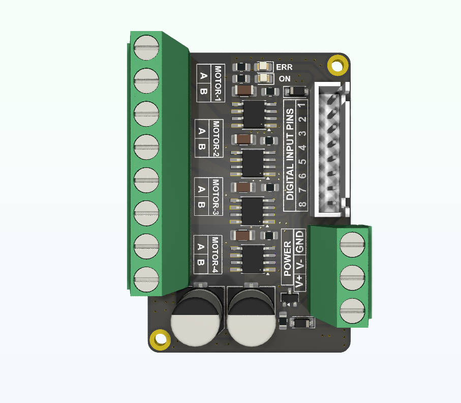

# 4-Channel DRV8871 Motor Driver

A compact **4-channel brushed DC motor driver board** based on the **TI DRV8871**, designed for controlling four independent DC motors with integrated reverse-polarity protection.

## Features

- 4 independent DC motor channels
- DRV8871-based motor control
- **2 A continuous output current per channel**
- **3.6 A peak output current per channel**
- Reverse-polarity protection
- Reverse polarity visual alert using ERR LED
- Screw terminals for motor connections
- 2.54 mm header pins for control signals
- Suitable for microcontroller-based control

## Specifications

| Parameter | Specification |
|---|---|
| Number of Channels | 4 |
| Motor Driver IC | TI DRV8871 |
| Motor Type | Brushed DC Motor |
| Continuous Current | **2 A / Channel** |
| Peak Current | **3.6 A / Channel** |
| Control Interface | 2.54 mm Header Pins |
| Motor Connection | Screw Terminals |
| Protection |PMOS Reverse-Polarity Protection |
| PCB Revision | Rev 2.0 |

## Channel Configuration

The board provides four independent motor-driver channels:

- **Channel 1 — Motor A**
- **Channel 2 — Motor B**
- **Channel 3 — Motor C**
- **Channel 4 — Motor D**

Each channel is controlled independently through the DRV8871 motor-driver circuitry.

## Applications

- Robotics
- Mobile robots
- DC motor control
- Automation systems
- Educational and development projects

## Revision History

### Rev 1.0

**Initial Release**

- Basic 4-channel DRV8871 motor driver
- 2.54 mm pins
- No additional protection 
- Four independent motor channels

### Rev 2.0

**Connectivity & Protection Upgrade**

- Added screw terminals
- Added reverse-polarity protection
- Improved ease of motor connection
- Improved protection on the power input

- ## License

This hardware design is released under the **CERN Open Hardware Licence Version 2 – Permissive (CERN-OHL-P-2.0)**.

You are free to use, study, modify, manufacture, and distribute hardware based on this design, subject to the terms and conditions of the licence.

**Copyright © 2026 Abhisek Mahapatro**

For the complete licence terms, see the [`LICENSE`](LICENSE) file.

